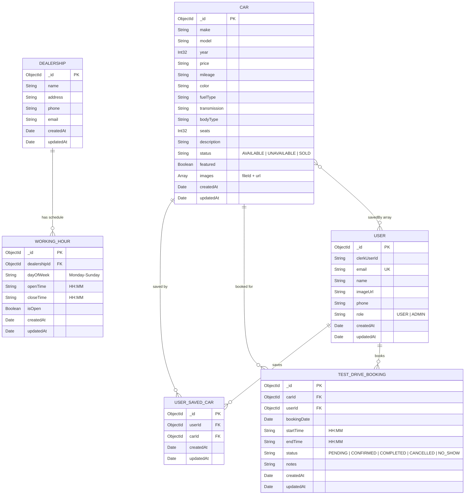

# 🚗 MotorSquare — AI-Powered Car Dealership Platform

> **Find Your Dream Car** — A full-stack car dealership web application with AI-powered image search, test drive booking, and a comprehensive admin panel.


---

## 📋 Table of Contents

- [Overview](#-overview)
- [Features](#-features)
- [Tech Stack](#-tech-stack)
- [Architecture](#-architecture)
- [Directory Structure](#-directory-structure)
- [Database Schema](#-database-schema)
- [ER Diagram](#-er-diagram)
- [API Routes](#-api-routes)
- [Pages & Routes](#-pages--routes)
- [Getting Started](#-getting-started)
- [Environment Variables](#-environment-variables)

---

## 🌟 Overview

**MotorSquare** is a modern, full-stack car dealership platform built with **Next.js 15 (App Router)**. It allows users to browse cars, search using text or AI-powered image recognition (via Google Gemini), save favorites, and book test drives. Admins can manage car listings, dealership settings, working hours, and user roles through a dedicated admin panel.

---

## ✨ Features

### 🔍 For Users
- **Browse Cars** — Filter by make, body type, fuel type, transmission, price range
- **AI Image Search** — Upload a car photo and Gemini AI identifies make, model, body type, and color to find matching listings
- **Car Details** — View detailed specs, image gallery, and EMI calculator
- **Save Favorites** — Wishlist/save cars for later (toggle on/off)
- **Test Drive Booking** — Book test drives with available time slots based on dealership working hours
- **My Reservations** — View and manage upcoming test drive bookings

### 🛠️ For Admins
- **Car Management** — Add new cars with AI-assisted form auto-fill from uploaded images, edit, delete listings
- **Image Upload** — Multi-image upload via ImageKit CDN
- **Dealership Settings** — Configure dealership name, address, phone, email
- **Working Hours** — Set open/close times and open/closed status per day of week
- **User Management** — View all users, update roles (USER ↔ ADMIN)

### 🤖 AI-Powered Features
- **Image-to-Search** — Upload a car image → Gemini extracts make, model, color, body type → auto-redirects to filtered results
- **AI Auto-Fill on Listing** — When creating a car listing, upload an image → Gemini fills make, model, year, price, mileage, fuel type, transmission, body type, and description

---

## 🛠️ Tech Stack

| Layer           | Technology                                                       |
|-----------------|------------------------------------------------------------------|
| **Framework**   | [Next.js 15.3](https://nextjs.org/) (App Router, Turbopack)     |
| **Language**    | JavaScript (ES Modules)                                          |
| **Database**    | [MongoDB](https://www.mongodb.com/) via [Mongoose 8](https://mongoosejs.com/) |
| **Auth**        | [Clerk](https://clerk.com/) (OAuth, session management)         |
| **AI**          | [Google Gemini 2.5 Flash](https://ai.google.dev/) (`@google/genai`) |
| **Image CDN**   | [ImageKit](https://imagekit.io/) (upload, transform, deliver)   |
| **UI Library**  | [Radix UI](https://www.radix-ui.com/) + [shadcn/ui](https://ui.shadcn.com/) |
| **Styling**     | [Tailwind CSS v4](https://tailwindcss.com/) + `tw-animate-css`  |
| **Forms**       | [React Hook Form](https://react-hook-form.com/) + [Zod](https://zod.dev/) |
| **File Upload** | [react-dropzone](https://react-dropzone.js.org/)                |
| **Toasts**      | [Sonner](https://sonner.emilkowal.dev/)                         |
| **Date Utils**  | [date-fns](https://date-fns.org/) + [react-day-picker](https://react-day-picker.js.org/) |
| **Icons**       | [Lucide React](https://lucide.dev/)                             |
| **Validation**  | [validator.js](https://github.com/validatorjs/validator.js)     |

---

## 🏗️ Architecture

```
┌──────────────────────────────────────────────────────────────┐
│                       CLIENT (Browser)                       │
│  Next.js App Router (React 19) + Tailwind + shadcn/ui       │
│  ┌────────────┐  ┌──────────────┐  ┌─────────────────┐      │
│  │  Home Page  │  │  Cars Page   │  │   Admin Panel   │      │
│  │  (search)   │  │  (filters)   │  │  (CRUD, config) │      │
│  └─────┬──────┘  └──────┬───────┘  └────────┬────────┘      │
└────────┼────────────────┼───────────────────┼────────────────┘
         │                │                   │
    ┌────▼────────────────▼───────────────────▼────────┐
    │             NEXT.JS SERVER LAYER                  │
    │  ┌──────────────┐  ┌───────────────────────┐      │
    │  │  API Routes   │  │  Server Actions        │     │
    │  │  (18 routes)  │  │  (car, admin, settings)│     │
    │  └──────┬───────┘  └──────────┬────────────┘      │
    │         │                     │                    │
    │  ┌──────▼─────────────────────▼──────────────┐    │
    │  │           MIDDLEWARE (Clerk Auth)           │    │
    │  │  Protects: /admin, /saved-cars, /reservations│  │
    │  └──────────────────┬────────────────────────┘    │
    └─────────────────────┼─────────────────────────────┘
                          │
    ┌─────────────────────▼─────────────────────────────┐
    │              EXTERNAL SERVICES                     │
    │  ┌─────────┐  ┌──────────┐  ┌──────────────┐      │
    │  │ MongoDB  │  │ Gemini   │  │  ImageKit    │      │
    │  │(Mongoose)│  │ 2.5 Flash│  │  (CDN)       │      │
    │  └─────────┘  └──────────┘  └──────────────┘      │
    └────────────────────────────────────────────────────┘
```

---

## 📂 Directory Structure

```
motor-square/
├── app/                          # Next.js App Router (pages, layouts, API routes)
│   ├── layout.js                 # Root layout (ClerkProvider, Header, Toaster)
│   ├── page.jsx                  # Home page (hero, featured cars, browse by make/body, FAQ, CTA)
│   ├── globals.css               # Global styles + Tailwind imports
│   ├── not-found.jsx             # Custom 404 page
│   ├── clientOnly.jsx            # Client-only wrapper component (hydration guard)
│   │
│   ├── (auth)/                   # Auth route group (no shared layout with main app)
│   │   ├── layout.jsx            # Centered auth layout
│   │   ├── sign-in/[[...sign-in]]/page.jsx   # Clerk Sign In page
│   │   └── sign-up/[[...sign-up]]/page.jsx   # Clerk Sign Up page
│   │
│   ├── (main)/                   # Main user-facing route group
│   │   ├── layout.js             # Main layout wrapper
│   │   ├── ClientLayout.jsx      # Client layout with Toaster
│   │   ├── cars/                 # Car browsing pages
│   │   │   ├── page.jsx          # Cars listing page (filters + grid)
│   │   │   ├── [id]/             # Dynamic car detail page
│   │   │   │   ├── page.jsx      # Car detail (fetches by ID)
│   │   │   │   └── _components/
│   │   │   │       ├── carDetails.jsx     # Full car detail view + test drive section
│   │   │   │       └── emi-calculator.jsx # EMI/loan calculator widget
│   │   │   ├── _components/
│   │   │   │   ├── carFilters.jsx         # Sidebar filters (make, body, fuel, transmission, price)
│   │   │   │   ├── carFilterControl.jsx   # Individual filter control component
│   │   │   │   ├── carListing.jsx         # Car grid with sort, search, pagination
│   │   │   │   └── carListingLoading.jsx  # Loading skeleton for car listings
│   │   │   └── hooks/
│   │   │       └── useGetCars.jsx         # Custom hook: fetch single car by ID
│   │   ├── saved-cars/           # Saved/wishlisted cars page
│   │   │   ├── page.jsx
│   │   │   └── _components/
│   │   │       └── saved-cars-list.jsx    # Render list of saved cars
│   │   ├── reservations/         # User's test drive reservations
│   │   │   ├── page.jsx
│   │   │   └── _components/
│   │   │       └── reservations-list.jsx  # Render booking list with status
│   │   └── test-drive/           # Test drive booking flow
│   │       └── [id]/
│   │           ├── page.jsx
│   │           └── _components/
│   │               └── test-drive-form.jsx  # Booking form (date, time, notes)
│   │
│   ├── (admin)/                  # Admin route group
│   │   └── admin/
│   │       ├── layout.js         # Admin layout (sidebar + auth guard)
│   │       ├── page.js           # Admin dashboard (placeholder)
│   │       ├── _components/
│   │       │   └── sidebar.jsx   # Admin sidebar navigation
│   │       ├── cars/
│   │       │   ├── page.jsx      # Admin car list (search, status, delete)
│   │       │   ├── create/
│   │       │   │   └── page.jsx  # Add new car form page
│   │       │   └── _components/
│   │       │       ├── add-car-form.jsx  # Car creation form with AI auto-fill
│   │       │       └── car-list.jsx      # Admin car table
│   │       └── settings/
│   │           ├── page.jsx      # Admin settings page
│   │           └── _components/
│   │               └── settings-form.jsx  # Dealership info + working hours + user management
│   │
│   ├── api/                      # API Routes (Next.js Route Handlers)
│   │   ├── bookTestDrive/route.js        # POST - Book a test drive
│   │   ├── deleteCar/route.js            # DELETE - Delete a car listing
│   │   ├── deleteUserTestDrive/route.js  # DELETE - Cancel a test drive booking
│   │   ├── files/upload/route.js         # POST - Upload files to ImageKit
│   │   ├── gemini-test/route.js          # POST - AI image analysis (Gemini)
│   │   ├── getAllCarFilters/route.js      # GET - Get distinct filter values
│   │   ├── getCarByFilters/route.js      # GET - Search cars with filters + pagination
│   │   ├── getCarById/route.js           # GET - Get single car + wishlist + test drive info
│   │   ├── getCarsBySearch/route.js      # GET - Text search across make/model/color
│   │   ├── getDealershipInfo/route.js    # GET - Get dealership info + working hours
│   │   ├── getUserById/route.js          # GET - Get user by Clerk ID
│   │   ├── getUserByName/route.js        # GET - Search users by name
│   │   ├── getUserSavedCars/route.js     # GET - Get user's saved/wishlisted cars
│   │   ├── getUserTestDrive/route.js     # GET - Get user's test drive bookings
│   │   ├── saveWorkingHours/route.js     # POST - Save dealership working hours
│   │   ├── toggleSavedCars/route.js      # POST - Toggle car save/unsave
│   │   ├── updateCar/route.js            # PUT - Update car details/status
│   │   └── updateUserRole/route.js       # PUT - Update user role (ADMIN only)
│   │
│   ├── model/                    # Mongoose Schema Definitions
│   │   ├── car.js                # Car model
│   │   ├── user.js               # User model
│   │   ├── dealership.js         # Dealership model
│   │   ├── savedCars.js          # UserSavedCar (junction table)
│   │   ├── testDriveBooking.js   # Test drive booking model
│   │   └── workingHour.js        # Working hours model
│   │
│   └── waitlist/                 # Waitlist page
│       └── page.jsx
│
├── actions/                      # Next.js Server Actions
│   ├── admin.js                  # getAdmin() — verify admin authorization
│   ├── car.js                    # processCarImageWithAI(), addCar(), getCars(), deleteCars()
│   ├── car-listing.js            # getCarFilter() — distinct makes (WIP)
│   └── settings.js               # getDealershipInfo(), saveWorkingHours(), getUser(), updateUserRole()
│
├── components/                   # Shared React Components
│   ├── Header.jsx                # Global header/navbar (auth-aware, admin link)
│   ├── CarCard.jsx               # Reusable car card component (image, specs, wishlist)
│   ├── home-search.jsx           # Search bar with text + AI image upload (react-dropzone)
│   ├── test-drive-card.jsx       # Test drive booking card with status badge
│   └── ui/                       # shadcn/ui component library
│       ├── accordion.jsx         ├── alert.jsx
│       ├── badge.jsx             ├── button.jsx
│       ├── calendar.jsx          ├── card.jsx
│       ├── checkbox.jsx          ├── dialog.jsx
│       ├── dropdown-menu.jsx     ├── input.jsx
│       ├── label.jsx             ├── pagination.jsx
│       ├── popover.jsx           ├── select.jsx
│       ├── sheet.jsx             ├── skeleton.jsx
│       ├── slider.jsx            ├── sonner.jsx
│       ├── table.jsx             ├── tabs.jsx
│       └── textarea.jsx
│
├── hooks/                        # Custom React Hooks
│   └── use-fetch.jsx             # Generic async data-fetching hook
│
├── lib/                          # Utility Functions & Configuration
│   ├── database.js               # MongoDB connection (singleton via Mongoose)
│   ├── checkUser.js              # Clerk → MongoDB user sync (creates user on first login)
│   ├── data.js                   # Static data: featured cars, car makes, body types, FAQs
│   ├── helper.js                 # serializedCarData() — normalize Mongoose docs for client
│   ├── utils.js                  # cn() — Tailwind class merge utility
│   └── test.js                   # Test/scratch file
│
├── public/                       # Static Assets
│   ├── logo-pk.png               # Main MotorSquare logo
│   ├── 1.png, 2.webp, 3.jpg     # Sample car images
│   ├── body/                     # Body type illustrations (SVG/PNG)
│   └── make/                     # Car manufacturer logos (WebP)
│
├── middleware.js                  # Clerk auth middleware (protects /admin, /saved-cars, /reservations)
├── next.config.mjs               # Next.js config (ImageKit domain, CSP headers)
├── components.json               # shadcn/ui configuration
├── package.json                  # Dependencies & scripts
├── jsconfig.json                 # Path aliases (@/ → root)
├── postcss.config.mjs            # PostCSS (Tailwind plugin)
├── eslint.config.mjs             # ESLint configuration
└── .gitignore                    # Git ignore rules
```

---

## 🗄️ Database Schema

### Collections

#### 1. `User`
| Field          | Type       | Constraints                    | Description                        |
|----------------|------------|--------------------------------|------------------------------------|
| `_id`          | ObjectId   | Auto-generated                 | Primary key                        |
| `clerkUserId`  | String     | Required                       | Clerk authentication ID            |
| `email`        | String     | Required, Unique               | User email address                 |
| `name`         | String     | Required                       | Full name                          |
| `imageUrl`     | String     | URL validated                  | Profile picture URL                |
| `phone`        | String     | Optional                       | Phone number                       |
| `role`         | String     | Enum: `USER`, `ADMIN`          | User role for authorization        |
| `savedCars`    | ObjectId[] | Ref → `UserSavedCar`          | Array of saved car references      |
| `testDrives`   | ObjectId[] | Ref → `TestDriveBooking`      | Array of test drive booking refs   |
| `createdAt`    | Date       | Auto (timestamps)              | Account creation time              |
| `updatedAt`    | Date       | Auto (timestamps)              | Last update time                   |

#### 2. `Car`
| Field               | Type       | Constraints                             | Description                    |
|---------------------|------------|-----------------------------------------|--------------------------------|
| `_id`               | ObjectId   | Auto-generated                          | Primary key                    |
| `make`              | String     | Required, Indexed                       | Manufacturer (e.g., Toyota)    |
| `model`             | String     | Required, Indexed                       | Model name (e.g., Camry)       |
| `year`              | Int32      | Required, Indexed                       | Manufacturing year             |
| `price`             | String     | Required, Indexed                       | Price in dollars               |
| `mileage`           | String     | Required                                | Mileage (Km/litre)            |
| `color`             | String     | Optional                                | Exterior color                 |
| `fuelType`          | String     | Indexed                                 | Petrol/Diesel/Electric/Hybrid  |
| `transmission`      | String     | Optional                                | Automatic/Manual/Semi-Auto     |
| `bodyType`          | String     | Optional                                | SUV/Sedan/Hatchback/etc.       |
| `seats`             | Int32      | Optional                                | Number of seats                |
| `description`       | String     | Optional                                | Listing description            |
| `status`            | String     | Enum: `AVAILABLE`, `UNAVAILABLE`, `SOLD`| Listing status                 |
| `featured`          | Boolean    | Default: false, Indexed                 | Show on homepage               |
| `images`            | Array      | `[{ fileId, url }]`                     | ImageKit uploaded images       |
| `savedBy`           | ObjectId[] | Ref → `User`                           | Users who saved this car       |
| `testDriveBookings` | ObjectId[] | Ref → `TestDriveBooking`               | Associated test drive bookings |
| `createdAt`         | Date       | Auto (timestamps)                       | Listing creation time          |
| `updatedAt`         | Date       | Auto (timestamps)                       | Last update time               |

#### 3. `UserSavedCar` (Junction Table)
| Field       | Type     | Constraints               | Description            |
|-------------|----------|---------------------------|------------------------|
| `_id`       | ObjectId | Auto-generated            | Primary key            |
| `userId`    | ObjectId | Required, Ref → `User`   | User who saved the car |
| `carId`     | ObjectId | Required, Ref → `Car`    | Car that was saved     |
| `createdAt` | Date     | Auto (timestamps)         | Save timestamp         |
| `updatedAt` | Date     | Auto (timestamps)         | Last update            |

**Indexes:** Compound unique `(userId, carId)`, individual on `userId` and `carId`

#### 4. `TestDriveBooking`
| Field         | Type     | Constraints                                                     | Description            |
|---------------|----------|-----------------------------------------------------------------|------------------------|
| `_id`         | ObjectId | Auto-generated                                                  | Primary key            |
| `carId`       | ObjectId | Required, Ref → `Car`                                          | Car for the test drive |
| `userId`      | ObjectId | Required, Ref → `User`                                         | User who booked        |
| `bookingDate` | Date     | Required                                                        | Date of the test drive |
| `startTime`   | String   | Required, Validated `HH:MM`                                    | Start time slot        |
| `endTime`     | String   | Required, Validated `HH:MM`                                    | End time slot          |
| `status`      | String   | Enum: `PENDING`, `CONFIRMED`, `COMPLETED`, `CANCELLED`, `NO_SHOW` | Booking status     |
| `notes`       | String   | Optional                                                        | Additional notes       |
| `createdAt`   | Date     | Auto (timestamps)                                               | Booking creation time  |
| `updatedAt`   | Date     | Auto (timestamps)                                               | Last update            |

**Indexes:** `carId`, `userId`, `bookingDate`, `status`

#### 5. `Dealership`
| Field          | Type       | Constraints                  | Description              |
|----------------|------------|------------------------------|--------------------------|
| `_id`          | ObjectId   | Auto-generated               | Primary key              |
| `name`         | String     | Default: "Vehiql Motors"     | Dealership name          |
| `address`      | String     | Default provided             | Physical address         |
| `phone`        | String     | Default provided             | Contact phone            |
| `email`        | String     | Default provided             | Contact email            |
| `workingHour`  | ObjectId[] | Ref → `WorkingHour`         | Weekly schedule          |
| `createdAt`    | Date       | Auto (timestamps)            | Creation time            |
| `updatedAt`    | Date       | Auto (timestamps)            | Last update              |

#### 6. `WorkingHour`
| Field          | Type     | Constraints                                            | Description             |
|----------------|----------|--------------------------------------------------------|-------------------------|
| `_id`          | ObjectId | Auto-generated                                         | Primary key             |
| `dealershipId` | ObjectId | Required, Ref → `Dealership`                          | Parent dealership       |
| `dayOfWeek`    | String   | Enum: Mon–Sun                                          | Day of the week         |
| `openTime`     | String   | Required, Validated `HH:MM`                           | Opening time            |
| `closeTime`    | String   | Required, Validated `HH:MM`                           | Closing time            |
| `isOpen`       | Boolean  | Default: true                                          | Is dealership open?     |
| `createdAt`    | Date     | Auto (timestamps)                                      | Creation time           |
| `updatedAt`    | Date     | Auto (timestamps)                                      | Last update             |

**Indexes:** Compound unique `(dealershipId, dayOfWeek)`, `isOpen`

---

## 📊 ER Diagram



---

## 🔌 API Routes

### Cars
| Method | Endpoint                | Auth     | Description                                  |
|--------|-------------------------|----------|----------------------------------------------|
| GET    | `/api/getCarsBySearch`  | Optional | Search cars by make/model/color              |
| GET    | `/api/getCarByFilters`  | Optional | Advanced filter (make, body, fuel, price, sort) |
| GET    | `/api/getCarById`       | Optional | Get single car + wishlist status + test drive info |
| GET    | `/api/getAllCarFilters` | No       | Get distinct filter values from available cars |
| DELETE | `/api/deleteCar`        | Admin    | Delete a car listing                         |
| PUT    | `/api/updateCar`        | Admin    | Update car details or status                 |

### AI
| Method | Endpoint            | Auth | Description                                  |
|--------|---------------------|------|----------------------------------------------|
| POST   | `/api/gemini-test`  | No   | Upload car image → Gemini AI extracts details |

### Test Drives
| Method | Endpoint                    | Auth     | Description                       |
|--------|-----------------------------|----------|-----------------------------------|
| POST   | `/api/bookTestDrive`        | Required | Book a test drive for a car       |
| GET    | `/api/getUserTestDrive`     | Required | Get user's test drive bookings    |
| DELETE | `/api/deleteUserTestDrive`  | Required | Cancel a test drive booking       |

### Users & Saved Cars
| Method | Endpoint                | Auth     | Description                        |
|--------|-------------------------|----------|------------------------------------|
| GET    | `/api/getUserById`      | Required | Get user by Clerk ID               |
| GET    | `/api/getUserByName`    | Required | Search users by name               |
| POST   | `/api/toggleSavedCars`  | Required | Toggle save/unsave a car           |
| GET    | `/api/getUserSavedCars` | Required | Get all saved cars for current user |
| PUT    | `/api/updateUserRole`   | Admin    | Update a user's role               |

### Dealership
| Method | Endpoint                  | Auth  | Description                       |
|--------|---------------------------|-------|-----------------------------------|
| GET    | `/api/getDealershipInfo`  | No    | Get dealership info + working hours |
| POST   | `/api/saveWorkingHours`   | Admin | Save/update working hour schedule |

### Files
| Method | Endpoint              | Auth | Description                |
|--------|-----------------------|------|----------------------------|
| POST   | `/api/files/upload`   | Admin| Upload images to ImageKit  |

---

## 🗺️ Pages & Routes

| Route                      | Access     | Description                                 |
|----------------------------|------------|---------------------------------------------|
| `/`                        | Public     | Home page — hero, featured cars, browse, FAQ |
| `/cars`                    | Public     | Browse all cars with filters & sorting      |
| `/cars/[id]`               | Public     | Car detail page with EMI calculator         |
| `/test-drive/[id]`         | Auth       | Test drive booking form                     |
| `/saved-cars`              | Auth       | User's wishlisted/saved cars                |
| `/reservations`            | Auth       | User's test drive bookings                  |
| `/sign-in`                 | Public     | Clerk sign-in page                          |
| `/sign-up`                 | Public     | Clerk sign-up page                          |
| `/admin`                   | Admin      | Admin dashboard                             |
| `/admin/cars`              | Admin      | Manage car listings                         |
| `/admin/cars/create`       | Admin      | Add new car with AI auto-fill               |
| `/admin/settings`          | Admin      | Dealership config, working hours, users     |
| `/waitlist`                | Public     | Waitlist signup page                        |

---

## 🚀 Getting Started

### Prerequisites
- **Node.js** >= 18
- **MongoDB** instance (local or Atlas)
- **Clerk** account (for auth keys)
- **Google AI** API key (for Gemini)
- **ImageKit** account (for image CDN)

### Installation

```bash
# Clone the repository
git clone https://github.com/rajasatyam/motor-square.git
cd motor-square

# Install dependencies
npm install

# Set up environment variables (see below)
cp .env.example .env.local

# Run the development server
npm run dev
```

Open [http://localhost:3000](http://localhost:3000) in your browser.

### Scripts

| Command          | Description                  |
|------------------|------------------------------|
| `npm run dev`    | Start dev server (Turbopack) |
| `npm run build`  | Production build             |
| `npm run start`  | Start production server      |
| `npm run lint`   | Run ESLint                   |

---

## 🔐 Environment Variables

Create a `.env.local` file in the project root:

```env
# MongoDB
MONGODB_URL=mongodb+srv://<user>:<password>@<cluster>.mongodb.net/<dbname>

# Clerk Authentication
NEXT_PUBLIC_CLERK_PUBLISHABLE_KEY=pk_test_...
CLERK_SECRET_KEY=sk_test_...
NEXT_PUBLIC_CLERK_SIGN_IN_URL=/sign-in
NEXT_PUBLIC_CLERK_SIGN_UP_URL=/sign-up
NEXT_PUBLIC_CLERK_AFTER_SIGN_IN_URL=/
NEXT_PUBLIC_CLERK_AFTER_SIGN_UP_URL=/

# Google Gemini AI
GEMINI_API_KEY=your_gemini_api_key

# ImageKit (Image CDN)
NEXT_PUBLIC_IMAGEKIT_PUBLIC_KEY=public_...
IMAGEKIT_PRIVATE_KEY=private_...
NEXT_PUBLIC_IMAGEKIT_URL_ENDPOINT=https://ik.imagekit.io/your_id
```

---

## 📄 License

This project is private and not licensed for public distribution.

---

<p align="center">
  Made with ❤️ by <strong>Piyush Kumar</strong>
</p>
